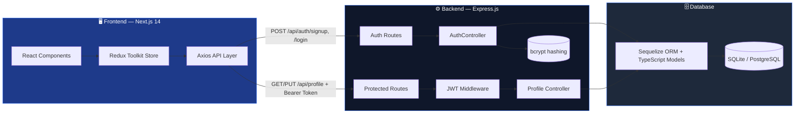
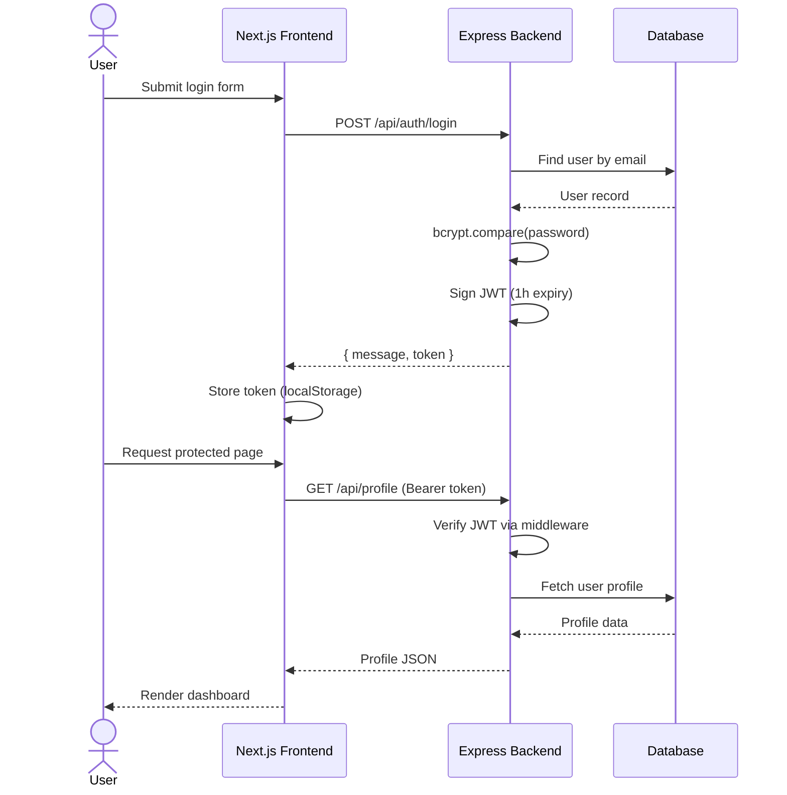

<div align="center">


<br/>

[](https://velmora-house.vercel.app)
[](./LICENSE)
[](https://nextjs.org)
[](https://www.typescriptlang.org)


</div>

<br/>

<p align="center">
  
</p>

<h3 align="center">✨ A modern, full-stack real estate marketplace — browse listings, manage properties, and handle secure user auth, all wrapped in a buttery-smooth animated UI. ✨</h3>

<br/>

---

## 📚 Table of Contents

<table>
<tr>
<td valign="top" width="33%">

- [🌟 Overview](#-overview)
- [🎬 Preview](#-preview)
- [⚡ Features](#-features)

</td>
<td valign="top" width="33%">

- [🧠 Tech Stack](#-tech-stack)
- [🏗️ Architecture](#️-architecture)
- [📁 Project Structure](#-project-structure)

</td>
<td valign="top" width="33%">

- [🚀 Getting Started](#-getting-started)
- [🔌 API Reference](#-api-reference)
- [🗺️ Roadmap](#️-roadmap)

</td>
</tr>
</table>

---

## 🌟 Overview

**VELMORA** is a full-stack real estate platform built to let users **browse, list, and manage property listings** with a real authentication system behind it — not just a static template. It pairs a **Next.js 14 + TypeScript** frontend with an **Express + Sequelize** backend, secured end-to-end with **JWT** and **bcrypt**.

> 🏡 Think Zillow-meets-boutique-agency: property grids, agent/agency profiles, comparisons, dashboards, and a design system with buttery scroll animations.

<div align="center">

| 🏠 17+ Listing Layouts | 🔐 JWT Auth System | 📊 Redux-Powered State | 📱 Fully Responsive |
|:---:|:---:|:---:|:---:|
| 🖼️ Lightbox Galleries | 🎨 WOW.js Scroll FX | 📈 Chart.js Dashboards | 🌗 Modular Components |

</div>

---

## 🎬 Preview

<div align="center">


<br/><br/>

<sub>💡 Replace this section with real screenshots / a screen-recording GIF of VELMORA once the UI is finalized — drop them in <code>/docs/preview</code> and reference them here for maximum GitHub star magnetism.</sub>
</div>

<div align="center">

| Home | Listings | Property Details |
|:---:|:---:|:---:|
|  |  |  |

</div>

---

## ⚡ Features

<table>
<tr>
<td width="50%" valign="top">

### 🔐 Authentication
- Secure signup / login with **JWT**
- Password hashing via **bcrypt** (10 salt rounds)
- Protected routes with custom middleware
- Editable user profile & account settings

### 🏘️ Property Management
- 17 unique listing page variants
- 6 property detail page layouts
- Side-by-side property comparison
- Shortlisting via Redux Toolkit

</td>
<td width="50%" valign="top">

### 🎨 UI/UX
- Scroll-triggered animations (WOW.js)
- Image lightbox galleries & video popups
- Toast notifications, form validation (Yup)
- Fully responsive across devices

### 📊 Dashboard & Insights
- Agent / Agency profile pages
- Chart.js analytics widgets
- Blog module with 3 layout styles
- Pagination across all listing views

</td>
</tr>
</table>

---

## 🧠 Tech Stack

<div align="center">

### Frontend


### Backend


### Tooling & Libraries


</div>

---

## 🏗️ Architecture





---

## 📁 Project Structure

```
VELMORA/
├── 📦 real-estate-backend/          # Express + TypeScript API
│   ├── src/
│   │   ├── controllers/             # AuthController
│   │   ├── middleware/              # JWT authentication
│   │   ├── models/                  # Sequelize-TS User model
│   │   ├── routes/                  # authRoutes, protectedRoutes
│   │   └── server.ts                # Entry point
│   └── migrations/                  # DB schema migrations
│
├── 💻 src/                          # Next.js frontend
│   ├── app/                         # 40+ routed pages (listings, dashboard, blog...)
│   ├── components/                  # homes, dashboard, forms, ListingDetails...
│   ├── redux/                       # store.ts + propertySlice, shortedSlice
│   ├── hooks/                       # UseProperty, useShortedProperty, UseSticky
│   ├── layouts/                     # Wrapper, headers, footers
│   ├── modals/                      # Login, Delete, ImagePopup, VideoPopup
│   └── utils/                       # api.ts, localstorage.ts, utils.ts
│
├── 🌐 public/assets/                # Images, fonts, css
├── PROJECT_DOCUMENTATION.md         # Full technical documentation
└── README.md
```

---

## 🚀 Getting Started

### Prerequisites
```bash
Node.js >= 18
npm >= 9
```

### 1️⃣ Clone the repository
```bash
git clone https://github.com/pradhummandil/VELMORA.git
cd VELMORA
```

### 2️⃣ Set up the frontend
```bash
npm install
cp .env.example .env.local
npm run dev
# ➜ http://localhost:3000
```

### 3️⃣ Set up the backend
```bash
cd real-estate-backend
npm install
npx sequelize-cli db:migrate     # if using PostgreSQL
npx ts-node src/server.ts
# ➜ http://localhost:5000
```

### 🔑 Environment Variables

<details>
<summary><strong>Frontend — <code>.env.local</code></strong></summary>

```env
NEXT_PUBLIC_API_BASE_URL=http://localhost:5000/api
```
</details>

<details>
<summary><strong>Backend — <code>.env</code></strong></summary>

```env
PORT=5000
NODE_ENV=development
JWT_SECRET=your_secret_key_here
DATABASE_URL=sqlite://database.sqlite

# Or for PostgreSQL
DB_HOST=localhost
DB_PORT=5432
DB_NAME=velmora
DB_USER=postgres
DB_PASSWORD=your_password
```
</details>

---

## 🔌 API Reference

| Method | Endpoint | Auth | Description |
|:------:|----------|:----:|-------------|
| `POST` | `/api/auth/signup` | ❌ | Register a new user |
| `POST` | `/api/auth/login` | ❌ | Authenticate & receive JWT |
| `GET` | `/api/profile` | ✅ | Fetch current user profile |
| `PUT` | `/api/profile` | ✅ | Update user profile |

<details>
<summary><strong>📬 Example requests</strong></summary>

```bash
# Signup
curl -X POST http://localhost:5000/api/auth/signup \
  -H "Content-Type: application/json" \
  -d '{"name":"John Doe","email":"john@example.com","password":"password123","termsAccepted":true}'

# Login
curl -X POST http://localhost:5000/api/auth/login \
  -H "Content-Type: application/json" \
  -d '{"email":"john@example.com","password":"password123"}'

# Get profile (protected)
curl -X GET http://localhost:5000/api/profile \
  -H "Authorization: Bearer <token>"
```
</details>

---

## 🗺️ Roadmap

- [x] JWT authentication (signup / login / profile)
- [x] Property listing pages (17 layout variants)
- [x] Redux-based state management
- [ ] Property CRUD API (Create / Update / Delete listings)
- [ ] Image upload pipeline (Multer + cloud storage)
- [ ] Server-side search & filtering
- [ ] Admin role-based authorization
- [ ] Deploy PostgreSQL production database
- [ ] CI/CD pipeline for automated deployment

---

## 🤝 Contributing

Contributions, issues, and feature requests are welcome!

```bash
1. Fork the repo
2. Create your feature branch   → git checkout -b feature/amazing-feature
3. Commit your changes          → git commit -m "Add amazing feature"
4. Push to the branch           → git push origin feature/amazing-feature
5. Open a Pull Request
```

---

## 📄 License

Distributed under the **MIT License**. See [`LICENSE`](./LICENSE) for details.

---

<div align="center">

### 👨‍💻 Author

**Pradhum Mandil**

[](https://github.com/pradhummandil)
[](https://instagram.com/heymandil__)

<br/>


**⭐ If VELMORA inspired you, drop a star — it genuinely helps!**

</div>
